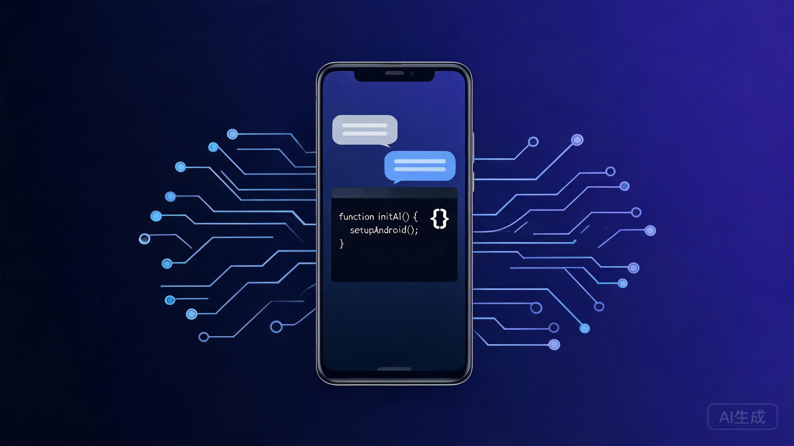

# Mobilecode（手机 AI 编程）

> **你的手机就是开发机。** 安装一个 APK，填入你自己的 API Key，让 AI 直接在安卓手机上帮你写代码、跑命令、管项目 —— 不需要电脑、不需要服务器、不需要云环境。

<p align="center">
  
</p>

<p align="center">
  <a href="#"></a>
  <a href="#"></a>
  <a href="#"></a>
  <a href="LICENSE"></a>
</p>

**[English](README.md)** | 中文文档

---

## 目录

- [这是什么？](#这是什么)
- [功能特性](#功能特性)
- [快速开始](#快速开始)
- [支持的模型服务商](#支持的模型服务商)
- [从源码构建](#从源码构建)
- [架构](#架构)
- [工作原理](#工作原理)
- [项目结构](#项目结构)
- [运行要求](#运行要求)
- [常见问题](#常见问题)
- [路线图与文档](#路线图与文档)
- [安全与许可证](#安全与许可证)

---

## 这是什么？

Mobilecode 是一个**安卓端的 AI 编程工作台**。APK 内置了完整的 Linux 用户态
（Termux 风格）：Node.js 24、npm、Codex CLI 及其 ARM64 原生引擎，以及一个
自托管的 Web 工作台。

首次启动时，环境**完全离线**解压（4 线程并行，约 1 分钟）。不需要
`apt install`、不需要 `npm install`、不需要 root、不需要服务器。设备唯一的
联网需求是调用你选择的模型服务商 API。

```
┌─────────────┐  安装 APK   ┌──────────────────────────────────────────┐
│    APK      │ ──────────► │  终端 / Web 工作台（本机 localhost）      │
│  images0-3  │             │  Codex CLI + 原生引擎                    │
│  （内置）    │  解压一次   │  Node.js 24 + npm                       │
│             │ ──────────► │  Termux Linux 用户态                     │
└─────────────┘             └──────────────────────────────────────────┘
                                   │  HTTPS（仅 API 调用）
                                   ▼
                        OpenAI · DeepSeek · Qwen · 智谱 GLM
```

## 功能特性

- **手机端零配置 AI 编程** —— 运行时镜像预置在 APK 内、带版本号
- **首启完全离线** —— 环境是解压出来的，不是下载出来的
- **4 线程并行解压** —— 首次启动约 1 分钟
- **多模型服务商** —— OpenAI（默认）/ DeepSeek / Qwen / 智谱 GLM，一键切换
- **API Key 安全存储** —— Android Keystore 加密（`SecureKeyStore`）
- **自托管 Web 工作台** —— 本机 `127.0.0.1:18923`，WebView 加载
- **内置 CONNECT 代理** —— 让原生二进制在设备内访问 HTTPS
- **诊断 + 一键重置环境** —— 出问题无需卸载重装
- **前台服务防杀** —— 适配电池优化白名单，后台存活
- **中英双语界面与错误提示** —— 错误信息清晰可操作，支持一键复制诊断信息反馈

## 快速开始

1. **下载 APK**

   最新版：[`release/Mobilecode-v0.6.1-release.apk`](release/Mobilecode-v0.6.1-release.apk)（约 90 MB）

2. **安装**

   把 APK 传到手机并打开，按提示开启「允许安装未知来源」。

3. **首次启动**

   自动解压内置运行环境（进度条，约 1 分钟），随后自动启动本地工作台。

4. **填入 API Key**

   点右上角 **⚙ 齿轮**，选择服务商、粘贴 API Key、确定。工作台自动重启，
   即可开始对话编程。

## 支持的模型服务商

| 服务商 | 默认模型 | Base URL | 环境变量 |
| --- | --- | --- | --- |
| OpenAI | `gpt-4.1-mini` | `api.openai.com` | `OPENAI_API_KEY` |
| DeepSeek | `deepseek-chat` | `api.deepseek.com` | `DEEPSEEK_API_KEY` |
| 通义千问（阿里） | `qwen-plus` | `dashscope.aliyuncs.com` | `DASHSCOPE_API_KEY` |
| 智谱 GLM | `glm-4.5` | `open.bigmodel.cn` | `ZHIPU_API_KEY` |

> 自带 API Key —— Key 不出设备，且加密存储。

## 从源码构建

### 前置要求

- **JDK 17**（AGP 8.7 / Kotlin 2.1 **不支持** JDK 21+）
- **Android SDK** —— 在 `android/local.properties` 写入 `sdk.dir=...`
  （首次需 `sdkmanager --licenses`）
- **Python 3.10+**
- **构建镜像需联网一次**：下载 Termux bootstrap / deb / Codex（约 150 MB，
  缓存于 `scripts/.cache`；镜像产物约 80 MB）

### 步骤

```bash
cd android

# 1. 预组装运行时镜像 → app/src/main/assets/images0..3.bin
python3 scripts/build-image.py

# 2. 构建 APK
./gradlew :app:assembleDebug
# 产物：app/build/outputs/apk/debug/app-debug.apk（约 90 MB）
```

> 第 1 步**不能跳过**：镜像分片就是 App 的运行时。APK 缺分片（或
> `.runtime-version` 不匹配）会导致启动失败。

## 架构

```
┌─────────────────────────────────────────────────────────────────┐
│                       Android APK（v0.6.1）                      │
│                                                                 │
│  ┌──────────────────────┐        ┌───────────────────────────┐  │
│  │      WebView 界面     │        │  MainActivity             │  │
│  │  http://127.0.0.1:   │        │  · 启动步骤               │  │
│  │       18923          │        │  · 诊断 & 重置             │  │
│  └──────────┬───────────┘        └────────────┬──────────────┘  │
│             │                                │                  │
│             ▼                                ▼                  │
│  ┌──────────────────────┐        ┌───────────────────────────┐  │
│  │ codex-web-local      │        │ CodexServerManager        │  │
│  │ 工作台服务器（设备内）│◄──────►│ · 安装/解压（4 线程）      │  │
│  │ (Node.js)            │        │ · 代理 127.0.0.1:18924    │  │
│  └──────────┬───────────┘        │ · 配置/凭据（Keystore）   │  │
│             │                    └────────────┬──────────────┘  │
│             ▼                                ▼                  │
│  ┌──────────────────────────────────────────────────────────┐   │
│  │  files/usr （Termux 风格 Linux 用户态，解压所得）          │   │
│  │  ├── bin/sh · node · npm · codex                         │   │
│  │  └── lib/node_modules/@openai/codex (+linux-arm64)       │   │
│  │      lib/node_modules/codex-web-local                    │   │
│  └──────────────────────────────────────────────────────────┘   │
│                       │ HTTPS（仅 API 调用）                     │
└───────────────────────┼─────────────────────────────────────────┘
                        ▼
              OpenAI · DeepSeek · Qwen · GLM
```

核心组件：

- **`build-image.py`** —— 在构建机预组装**成品镜像**（Termux bootstrap + Node +
  Codex + 工作台），改写绝对路径、镜像瘦身、校验动态依赖，最后拆成 **4 个
  gzip+tar 分片**供并行解压。
- **`TarExtractor.kt`** —— 设备端流式解压，完整支持 GNU/PAX tar（长名、符号链接、
  权限位）；每个分片由独立线程解压。
- **`CodexServerManager.kt`** —— 安装生命周期、版本检查（`needsInstall`）、
  CONNECT 代理、工作台服务器、服务商配置与健康检查。
- **`SecureKeyStore.kt`** —— 用 Android Keystore 密钥加密 API Key。
- **`MainActivity.kt`** —— 分步启动流程：进度、错误恢复（重试/诊断/重置）、
  内嵌 WebView 工作台。

## 工作原理

1. **镜像带版本** —— 镜像内含 `.runtime-version`（当前 `0.4.1`）。一旦与 App
   期望版本不符，App 只重解压一次，陈旧环境不会卡死启动。
2. **一次离线安装** —— 首启把分片解压到 `files/usr/`，写入全权限 Codex 配置，
   并初始化 git 工作区。
3. **本地网络** —— `127.0.0.1:18924` 的 Node CONNECT 代理桥接原生二进制访问
   HTTPS；工作台服务器监听 `127.0.0.1:18923`。
4. **你的 Key、你的模型** —— 服务商与 Key 写入 App 沙箱内 `~/.codex/config.toml`
   和 `auth.json`，只联系你选的服务商。

## 项目结构

```
mobilecode-repo/
├── README.md               ← 英文版
├── README.zh-CN.md         ← 本文档
├── CHANGELOG.md            ← 版本记录
├── DESIGN.md               ← 设计说明与决策
├── SECURITY.md             ← 安全策略
├── CONTRIBUTING.md         ← 贡献指南
├── THIRD_PARTY_NOTICES.md  ← 内置开源组件清单
├── art/                    ← 宣传/主图素材
├── docs/
│   ├── ROADMAP.md          ← 路线图与里程碑
│   ├── workbench-audit-2026-09.md ← 工作台前端对标检查报告
│   └── domestic-models.md  ← 国产模型接入说明
├── release/                ← 预构建 APK
└── android/                ← 精选源码镜像（完整源码见 openclaw-android）
```

## 常见问题

| 现象 | 处理 |
| --- | --- |
| **APK 提示「无法安装 / 应用未安装」** | ① 手机上装过 v0.4.x 旧版？**先卸载旧版再装 v0.5.0+**（旧版是另一套 debug 证书签名，签名不一致系统会拒绝升级）；② 确认系统是 Android 7.0+ 且为 ARM64 芯片；③ 通过微信/QQ 传输的 APK 可能被改名或截断，建议用网关/USB 传输；④ MIUI：设置→开发者选项→打开「USB 安装」。v0.5.0 起 APK 使用正式证书 + v2/v3 签名方案（旧版为 debug 证书），且 debug/release 统一证书，安装兼容性已最大化。 |
| 打开提示「内置运行环境解压失败」 | 点「重试」；仍失败则进 **⚙ → 诊断与环境** 查看存储剩余（需 >500 MB），点「重置环境」。 |
| 每次启动都重新解压环境 | 版本失配：镜像内 `.runtime-version` 必须等于 `CodexServerManager.kt` 的 `RUNTIME_IMAGE_VERSION`。用 `build-image.py` 重建镜像（v0.4.1 起两者一致）。 |
| 换机器 Gradle 构建失败 | v0.5.0 起仓库不再携带构建机专属配置：只需 JDK 17 + Android SDK（`android/local.properties` 写 `sdk.dir`）。国内网络已内置阿里云 Maven 镜像与 Gradle 腾讯镜像，无需代理。 |
| 工作台起来了但 API 调用失败 | 检查 ⚙ 里的 Key，确认设备能访问对应服务商接口。 |

## 运行要求

- Android 7.0（API 24）及以上，**ARM64** 设备
- 约 500 MB 可用存储
- 仅调用模型 API 需联网（构建镜像时也需联网）

## 路线图与文档

- [ROADMAP.md](docs/ROADMAP.md) —— 下一步规划
- [workbench-audit-2026-09.md](docs/workbench-audit-2026-09.md) —— 工作台前端对标 2026 检查（P0 缺口与修复路线）
- [DESIGN.md](DESIGN.md) —— 架构取舍与理由
- [CHANGELOG.md](CHANGELOG.md) —— 版本历史

## 安全与许可证

- **安全**：见 [SECURITY.md](SECURITY.md)（策略与漏洞上报方式）。
- **许可证**：[MIT](LICENSE) · 内置组件清单见
  [THIRD_PARTY_NOTICES.md](THIRD_PARTY_NOTICES.md)。
- **声明**：早期阶段项目。运行 AI 生成的代码前请自行审查，并妥善保管 API Key。
