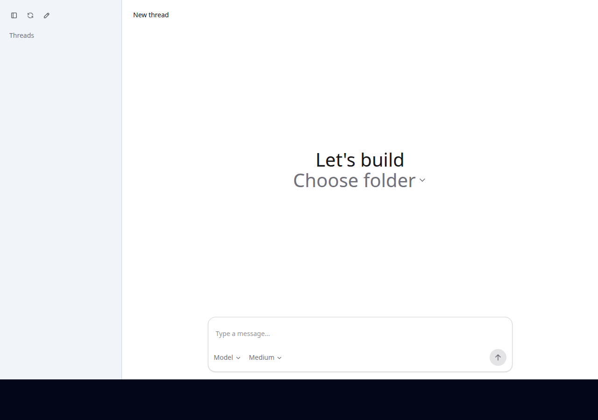
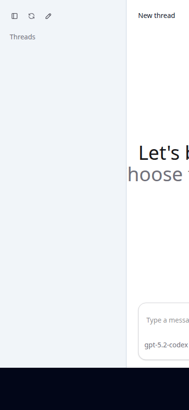

# 工作台前端对标 2026 检查报告（2026-09）

> 结论先行：**引擎与运行时已是完整可用的 2026 级 agent 底座；短板集中在前端移动适配与能力暴露。**
> 本报告基于真实运行环境（qemu ARM64 引擎 + mock 上游）+ Playwright 浏览器实测 + 前端 bundle 逆向 + Kotlin 集成审查得出。

## 一、工作台是什么

App 首页即内嵌 WebView 加载的本地工作台（上游 [codex-web-local](https://github.com/pavel-voronin/codex-web-local) v0.1.0，React + Vite + Tailwind，构建产物 238KB）：

```
WebView → http://127.0.0.1:18923（仅本机绑定）
        → dist-cli（express，JSON-RPC 透传 + SSE）
        → codex app-server（stdin/stdout）
        → 引擎 → 上游模型
```

服务端 API 面：`/codex-api/rpc`（60 个方法全透传）、`/codex-api/events`（SSE 通知）、
`/codex-api/server-requests/*`（审批通道）、`/codex-api/meta/*`。

## 二、实测确认的能力

- ✅ 会话列表（4s 轮询可开关）/ 恢复（thread/resume）/ 归档 / 置顶 / 新建
- ✅ 模型下拉（model/list）+ 推理力度 none→xhigh 六档
- ✅ 发送 / 停止（turn/interrupt）；审批响应通道已在代码中
- ✅ **持续对话全链路真实可用**（本报告实测）：
  `thread/start → turn/start → 引擎经 qemu 真实执行 echo 工具 → 输出回传 → 回答收敛（E2E OK — real agent loop verified）→ turn completed → rollout 落盘 → 刷新后会话恢复可继续`
- ✅ WebView 集成（Kotlin）：JS/DOMStorage、外链交系统浏览器、返回键、控制台日志桥接

桌面视图：



## 三、缺陷清单（实测证据）

> **2026-09 修复状态（v0.7.0）**：P0-1 / P0-2 / markdown / 工具过程 / i18n（含俄语残留）
> **已全部修复**，采用「注入层补丁」架构（不改上游 bundle，升级零合并成本），
> 详见 [CHANGELOG v0.7.0](../CHANGELOG.md)。未修复项：图片上传（P1）、
> Skills/MCP 管理页（P2）、语音输入（P2）、用量显示（P2）。

### P0-1：移动端布局破版 ✅ 已修复（v0.7.0）

390×844（典型手机）下侧栏不折叠，占屏约 2/3，会话主区与输入框被挤出屏幕外。
上游为桌面浏览器设计，无移动端断点。



修复后：侧栏抽屉化 + 汉堡导航，主区 grid 列完整改写（`--layout-columns` 须给全轨道定义），
390×844 三态实测正常，桌面回归无影响。

### P0-2：新装用户无法发出第一条消息（UX 死锁）✅ 已修复（v0.7.0）

前端逻辑（bundle 逆向确认）：目录下拉的选项 = 历史会话 cwd 去重集合；
新装 app 无任何历史 → 下拉为空且 disabled。
而会话（thread）在首条用户消息前不物化、不进 Threads 列表——循环依赖。
上游桌面场景靠浏览器目录选择器规避，Android WebView 内无此途径。

实测：直接经 RPC 创建会话并发消息成功后，刷新页面 UI 即恢复正常（选项出现、列表可用）——
死锁只卡"从零到第一条消息"这一步。

修复后：注入「开始构建」引导会话（fetch 劫持：替身 thread/resume → 后台真实
thread/start → turn/start 透明映射），用户选目录、发首条消息即物化真实会话，全链路实测通过。

### P1：渲染与透明度（markdown/工具过程 ✅ 已修复；图片上传未修）

- ~~无 markdown / 代码高亮渲染~~ ✅ v0.7.0：marked + DOMPurify + highlight.js 注入式渲染
  （MutationObserver + 特征启发式 + 幂等标记）
- ~~工具执行过程不展示~~ ✅ v0.7.0：独立订阅 SSE `item/started|completed`，右下角浮层
  实时显示命令执行状态（运行中/成功/失败 + 退出码），最近 20 条
- 无图片/文件上传（引擎 InputItem 支持 image，UI 未接）——**待修**

### P2：能力闲置与体验短板（i18n ✅ 已修复；其余未修）

- 前端仅使用引擎 60 个 RPC 方法中的 **9 个**；skills（×4）、MCP（×3）、review/start、
  turn/steer（对话中途转向）、thread/compact（上下文压缩）、thread/rollback、
  gitDiffToRemote、fuzzyFileSearch、rateLimits 等全部无 UI 入口——**待修**
- 无语音输入；无用量/速率显示——**待修**
- ~~无 i18n（上游残留俄语 aria-label "Стоп"）~~ ✅ v0.7.0：界面全面中文化
- 主题跟随系统暗色模式未确认

## 四、修复路线

| 优先级 | 项 | 方案草案 |
|---|---|---|
| P0 | 目录死锁 | dist-cli 支持 `--roots` 下发目录列表（或 Kotlin 端经 RPC 预置默认 cwd 引导会话） |
| P0 | 侧栏折叠 | 前端加移动端断点（`max-md` 隐藏侧栏 + 抽屉式展开）；WebView 配 adjustResize |
| P1 | markdown 渲染 | marked + highlight.js（约 60KB），注意 XSS 转义 |
| P1 | 工具过程展示 | 消费 SSE 的 exec 通知渲染可折叠步骤卡片 |
| P1 | 图片上传 | 输入框接引擎 image InputItem |
| P2 | Skills/MCP 管理页 | 直接调已有 RPC |
| P2 | 语音输入 | Android SpeechRecognizer → 输入框 |
| P2 | i18n / 用量 | 顺带清理俄语残留 |

## 五、二轮深挖（v0.7.1，2026-09-14）

v0.7.0 修复上线后，以挑刺视角对前端细节与大使用场景做二轮实测（上游断连/发消息/暗色/
转屏/XSS 注入/200 条消息压测），新抓 4 缺陷全部修复：

| # | 缺陷 | 根因 | 修复 |
|---|---|---|---|
| 1 | 用户消息被 markdown 误渲染，字面 `**粗体**` 被替换成粗体 | v0.7.0 补丁扫所有 `.message-text`，不分角色 | 只渲染 `li[data-role=assistant]`；用户消息永远原样；流式 delta 按长度变化重渲染；链接强制 `_blank + noopener` |
| 2 | 抽屉跨断点残留：手机开抽屉后转横屏，全屏遮罩卡死无入口关 | mc-nav-open 类无断点复位 | matchMedia 离开移动断点自动复位 |
| 3 | 暗色模式完全不支持（layout 写死亮色，CSS/JS 0 处 dark 逻辑） | 上游缺陷 | 补丁层 prefers-color-scheme 关键面覆盖（layout/主区白容器/header/composer/侧栏/消息卡），双模式截图回归 |
| 4 | turn 失败完全静默：上游断连发消息，无任何错误提示，消息石沉大海 | 引擎有 StreamErrorEvent/TurnError，前端 bundle 0 处消费 | 补丁 #mc-banner 提示条：无回复/失败载荷/SSE 断连三类兜底提示 |

**二轮实测通过项**：XSS 防御（img onerror/script/iframe/javascript: 全被 DOMPurify 拦截）；
长会话性能（200 条 md 消息 3 秒渲染完，幂等 + rAF 节流有效）。

## 六、一句话总结

**引擎是 2026 级的，前端是 2024 级的**——两个 P0 都是小改动可解，修复后工作台即可达到当前主流 agent 产品的可用线。
